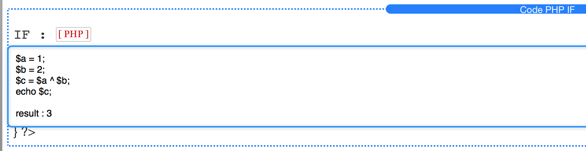
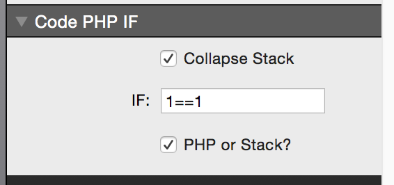
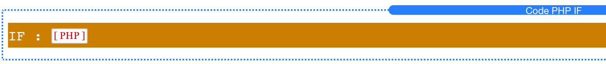

# PHP-Stack IF Extension

Program in PHP with RapidWeaver Stacks? Us this stack in combination with [PHP-Stack](https://github.com/iSkore/PHP-Stack) to fix a few of the PHP problems prevalent throughout Stacks and Stacks plugins. Drag and drop other stacks right into the PHP IF Extension and use the power of PHP without the hassle.

Add this to your Stack page to use simple PHP if statements without the hassle of encasing a stack within two HTML stacks. Using PHP within an HTML stack "works" but has some pretty bad issues that occur when doing open ended PHP statements.

Put in your if ( ) statement right in the UI side bar. You can choose between programming PHP inside the stack, or dropping another stack in. Common uses for user login information, form submitting, sending emails, showing and hiding other stacks, etc.

## Screenshots

Template stack for IF statement. Drop a stack in.

===========

Program PHP instead.

===========

Put your condition in the text field as if it were already encased in: if ( … )

===========

Collapse the stack to keep your pages organized and clean.

===========

## Contributors

- [Nick Soggin](http://www.dreamthegame.com), iSkore Development Inc.
- [Clay O'Keefe](http://www.dreamthegame.com), iSkore Development Inc.

## License

PHP Stack IF Extension is released under the MIT License:

The MIT License (MIT)

Copyright (c) 2015 iSkore Development Inc.

Permission is hereby granted, free of charge, to any person obtaining a copy
of this software and associated documentation files (the "Software"), to deal
in the Software without restriction, including without limitation the rights
to use, copy, modify, merge, publish, distribute, sublicense, and/or sell
copies of the Software, and to permit persons to whom the Software is
furnished to do so, subject to the following conditions:

The above copyright notice and this permission notice shall be included in all
copies or substantial portions of the Software.

THE SOFTWARE IS PROVIDED "AS IS", WITHOUT WARRANTY OF ANY KIND, EXPRESS OR
IMPLIED, INCLUDING BUT NOT LIMITED TO THE WARRANTIES OF MERCHANTABILITY,
FITNESS FOR A PARTICULAR PURPOSE AND NONINFRINGEMENT. IN NO EVENT SHALL THE
AUTHORS OR COPYRIGHT HOLDERS BE LIABLE FOR ANY CLAIM, DAMAGES OR OTHER
LIABILITY, WHETHER IN AN ACTION OF CONTRACT, TORT OR OTHERWISE, ARISING FROM,
OUT OF OR IN CONNECTION WITH THE SOFTWARE OR THE USE OR OTHER DEALINGS IN THE
SOFTWARE.
